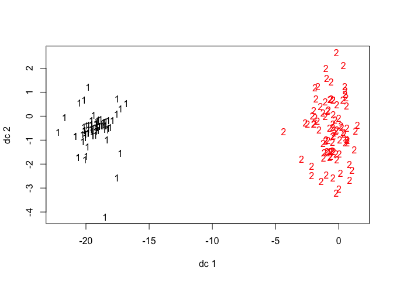
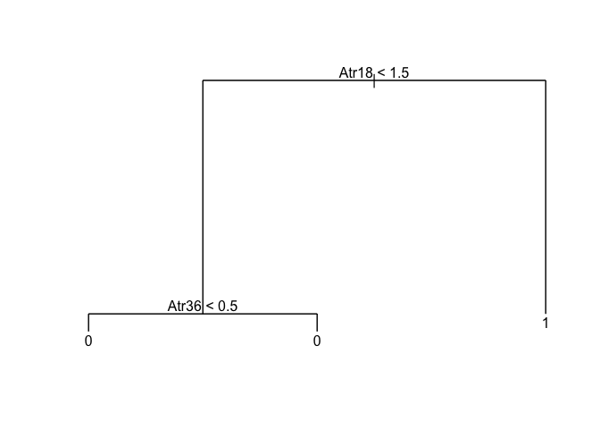
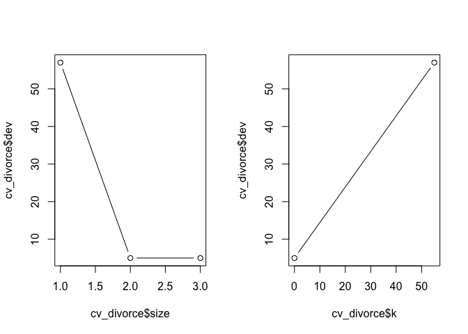
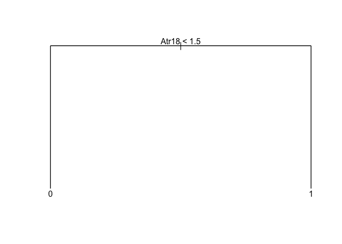
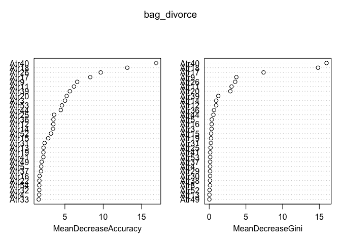
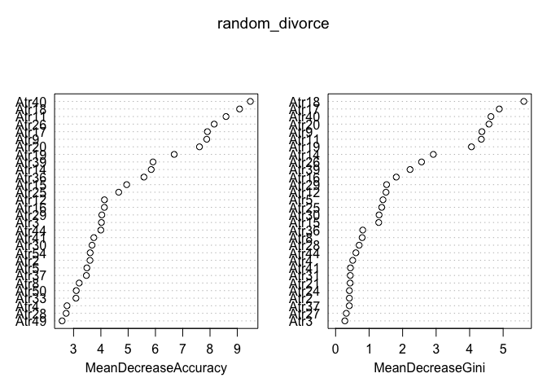

Final Project
================

This is an [R Markdown](http://rmarkdown.rstudio.com) Notebook. When you
execute code within the notebook, the results appear beneath the code.

Try executing this chunk by clicking the *Run* button within the chunk
or by placing your cursor inside it and pressing *Cmd+Shift+Enter*.

``` r
divorce_data <- read.csv("divorce.csv", header=TRUE)
head(divorce_data)
```

    ##   Atr1 Atr2 Atr3 Atr4 Atr5 Atr6 Atr7 Atr8 Atr9 Atr10 Atr11 Atr12 Atr13
    ## 1    2    2    4    1    0    0    0    0    0     0     1     0     1
    ## 2    4    4    4    4    4    0    0    4    4     4     4     3     4
    ## 3    2    2    2    2    1    3    2    1    1     2     3     4     2
    ## 4    3    2    3    2    3    3    3    3    3     3     4     3     3
    ## 5    2    2    1    1    1    1    0    0    0     0     0     1     0
    ## 6    0    0    1    0    0    2    0    0    0     1     0     2     1
    ##   Atr14 Atr15 Atr16 Atr17 Atr18 Atr19 Atr20 Atr21 Atr22 Atr23 Atr24 Atr25
    ## 1     1     0     1     0     0     0     1     0     0     0     0     0
    ## 2     0     4     4     4     4     3     2     1     1     0     2     2
    ## 3     3     3     3     3     3     3     2     1     0     1     2     2
    ## 4     4     3     3     3     3     3     4     1     1     1     1     2
    ## 5     1     1     1     1     1     2     1     1     0     0     0     0
    ## 6     0     2     0     2     1     0     1     0     0     0     0     2
    ##   Atr26 Atr27 Atr28 Atr29 Atr30 Atr31 Atr32 Atr33 Atr34 Atr35 Atr36 Atr37
    ## 1     0     0     0     0     1     1     2     1     2     0     1     2
    ## 2     1     2     0     1     1     0     4     2     3     0     2     3
    ## 3     2     2     2     3     2     3     3     1     1     1     1     2
    ## 4     1     1     1     1     3     2     3     2     2     1     1     3
    ## 5     2     1     2     1     1     1     1     1     1     0     0     0
    ## 6     2     0     0     0     0     4     1     1     1     1     1     1
    ##   Atr38 Atr39 Atr40 Atr41 Atr42 Atr43 Atr44 Atr45 Atr46 Atr47 Atr48 Atr49
    ## 1     1     3     3     2     1     1     2     3     2     1     3     3
    ## 2     4     2     4     2     2     3     4     2     2     2     3     4
    ## 3     1     3     3     3     3     2     3     2     3     2     3     1
    ## 4     3     4     4     2     2     3     2     3     2     2     3     3
    ## 5     0     2     1     0     2     3     0     2     2     1     2     3
    ## 6     2     0     2     2     1     2     3     0     2     2     1     2
    ##   Atr50 Atr51 Atr52 Atr53 Atr54 Class
    ## 1     3     2     3     2     1     1
    ## 2     4     4     4     2     2     1
    ## 3     1     1     2     2     2     1
    ## 4     3     3     2     2     2     1
    ## 5     2     2     2     1     0     1
    ## 6     1     1     1     2     0     1

``` r
# na.exclude(divorce_data)
```

``` r
table(divorce_data$Class)
```

    ## 
    ##  0  1 
    ## 86 84

``` r
tdat =  data.frame((divorce_data))


# median for each column
(sapply(tdat, median))
```

    ##  Atr1  Atr2  Atr3  Atr4  Atr5  Atr6  Atr7  Atr8  Atr9 Atr10 Atr11 Atr12 
    ##   2.0   2.0   2.0   1.0   1.0   0.0   0.0   1.0   1.0   2.0   1.0   1.5 
    ## Atr13 Atr14 Atr15 Atr16 Atr17 Atr18 Atr19 Atr20 Atr21 Atr22 Atr23 Atr24 
    ##   2.0   1.0   1.0   1.0   1.0   1.0   1.0   1.0   1.0   0.0   0.0   1.0 
    ## Atr25 Atr26 Atr27 Atr28 Atr29 Atr30 Atr31 Atr32 Atr33 Atr34 Atr35 Atr36 
    ##   1.0   1.0   1.0   0.5   1.0   1.0   2.0   2.0   1.0   1.0   0.5   0.0 
    ## Atr37 Atr38 Atr39 Atr40 Atr41 Atr42 Atr43 Atr44 Atr45 Atr46 Atr47 Atr48 
    ##   2.0   1.0   2.0   1.5   2.0   2.0   3.0   2.0   3.0   3.0   2.0   3.0 
    ## Atr49 Atr50 Atr51 Atr52 Atr53 Atr54 Class 
    ##   3.0   2.0   3.0   3.0   2.0   2.0   0.0

``` r
# mean for each column
(sapply(tdat, mean))
```

    ##      Atr1      Atr2      Atr3      Atr4      Atr5      Atr6      Atr7 
    ## 1.7764706 1.6529412 1.7647059 1.4823529 1.5411765 0.7470588 0.4941176 
    ##      Atr8      Atr9     Atr10     Atr11     Atr12     Atr13     Atr14 
    ## 1.4529412 1.4588235 1.5764706 1.6882353 1.6529412 1.8352941 1.5705882 
    ##     Atr15     Atr16     Atr17     Atr18     Atr19     Atr20     Atr21 
    ## 1.5705882 1.4764706 1.6529412 1.5176471 1.6411765 1.4588235 1.3882353 
    ##     Atr22     Atr23     Atr24     Atr25     Atr26     Atr27     Atr28 
    ## 1.2470588 1.4117647 1.5117647 1.6294118 1.4882353 1.4000000 1.3058824 
    ##     Atr29     Atr30     Atr31     Atr32     Atr33     Atr34     Atr35 
    ## 1.4941176 1.4941176 2.1235294 2.0588235 1.8058824 1.9000000 1.6705882 
    ##     Atr36     Atr37     Atr38     Atr39     Atr40     Atr41     Atr42 
    ## 1.6058824 2.0882353 1.8588235 2.0882353 1.8705882 1.9941176 2.1588235 
    ##     Atr43     Atr44     Atr45     Atr46     Atr47     Atr48     Atr49 
    ## 2.7058824 1.9411765 2.4588235 2.5529412 2.2705882 2.7411765 2.3823529 
    ##     Atr50     Atr51     Atr52     Atr53     Atr54     Class 
    ## 2.4294118 2.4764706 2.5176471 2.2411765 2.0117647 0.4941176

``` r
# https://www.tutorialspoint.com/r/r_mean_median_mode.htm
# mode function adopted from this site
getmode <- function(v) {
   uniqv <- unique(v)
   uniqv[which.max(tabulate(match(v, uniqv)))]
}
sapply(tdat, getmode)
```

    ##  Atr1  Atr2  Atr3  Atr4  Atr5  Atr6  Atr7  Atr8  Atr9 Atr10 Atr11 Atr12 
    ##     0     0     3     0     0     0     0     0     0     0     0     0 
    ## Atr13 Atr14 Atr15 Atr16 Atr17 Atr18 Atr19 Atr20 Atr21 Atr22 Atr23 Atr24 
    ##     0     0     0     0     0     0     0     0     0     0     0     0 
    ## Atr25 Atr26 Atr27 Atr28 Atr29 Atr30 Atr31 Atr32 Atr33 Atr34 Atr35 Atr36 
    ##     0     0     0     0     0     0     4     4     0     0     0     0 
    ## Atr37 Atr38 Atr39 Atr40 Atr41 Atr42 Atr43 Atr44 Atr45 Atr46 Atr47 Atr48 
    ##     4     0     4     0     4     4     4     0     4     4     4     4 
    ## Atr49 Atr50 Atr51 Atr52 Atr53 Atr54 Class 
    ##     4     4     4     4     4     4     0

``` r
#median counts
table(round(sapply(tdat, getmode)))
```

    ## 
    ##  0  3  4 
    ## 37  1 17

``` r
#sum of answers for each column
(sapply(tdat, sum))
```

    ##  Atr1  Atr2  Atr3  Atr4  Atr5  Atr6  Atr7  Atr8  Atr9 Atr10 Atr11 Atr12 
    ##   302   281   300   252   262   127    84   247   248   268   287   281 
    ## Atr13 Atr14 Atr15 Atr16 Atr17 Atr18 Atr19 Atr20 Atr21 Atr22 Atr23 Atr24 
    ##   312   267   267   251   281   258   279   248   236   212   240   257 
    ## Atr25 Atr26 Atr27 Atr28 Atr29 Atr30 Atr31 Atr32 Atr33 Atr34 Atr35 Atr36 
    ##   277   253   238   222   254   254   361   350   307   323   284   273 
    ## Atr37 Atr38 Atr39 Atr40 Atr41 Atr42 Atr43 Atr44 Atr45 Atr46 Atr47 Atr48 
    ##   355   316   355   318   339   367   460   330   418   434   386   466 
    ## Atr49 Atr50 Atr51 Atr52 Atr53 Atr54 Class 
    ##   405   413   421   428   381   342    84

``` r
# variance for each column
(sapply(tdat, var))
```

    ##      Atr1      Atr2      Atr3      Atr4      Atr5      Atr6      Atr7 
    ## 2.6479638 2.1569440 2.0034807 2.2630003 2.6639749 0.8172990 0.8076575 
    ##      Atr8      Atr9     Atr10     Atr11     Atr12     Atr13     Atr14 
    ## 2.3912635 2.4272885 2.0207449 2.7128785 2.1569440 2.1857292 2.2583014 
    ##     Atr15     Atr16     Atr17     Atr18     Atr19     Atr20     Atr21 
    ## 2.2701357 2.2627567 2.6066481 2.4523495 2.6929690 2.4154542 2.1087365 
    ##     Atr22     Atr23     Atr24     Atr25     Atr26     Atr27     Atr28 
    ## 2.0924469 2.5986773 2.2631744 2.3411417 2.2513401 2.1230769 2.1544031 
    ##     Atr29     Atr30     Atr31     Atr32     Atr33     Atr34     Atr35 
    ## 2.5354682 2.2632788 2.7124608 2.6355726 3.1869474 2.6585799 3.3938044 
    ##     Atr36     Atr37     Atr38     Atr39     Atr40     Atr41     Atr42 
    ## 3.2342847 2.9448312 3.0095371 2.9566655 3.2257570 2.9644622 2.4775844 
    ##     Atr43     Atr44     Atr45     Atr46     Atr47     Atr48     Atr49 
    ## 1.8183084 2.8367560 2.2497738 1.8817960 2.5180647 1.2935607 2.2848938 
    ##     Atr50     Atr51     Atr52     Atr53     Atr54     Class 
    ## 1.9742778 1.5882005 2.1801601 2.2669335 2.7809259 0.2514445

``` r
# overall variacne
mean(sapply(tdat, var))
```

    ## [1] 2.332202

``` r
library(caret)
```

    ## Loading required package: lattice

    ## Loading required package: ggplot2

``` r
library(leaps)
library("InformationValue")
```

    ## 
    ## Attaching package: 'InformationValue'

    ## The following objects are masked from 'package:caret':
    ## 
    ##     confusionMatrix, precision, sensitivity, specificity

``` r
set.seed(1)

trainIndex  = createDataPartition(divorce_data$Class, p = .7, list = FALSE, times = 1)

divorce_train =  divorce_data[ trainIndex,]
divorce_test  =  divorce_data[-trainIndex,]
```

``` r
sapply(divorce_data, sum)
```

    ##  Atr1  Atr2  Atr3  Atr4  Atr5  Atr6  Atr7  Atr8  Atr9 Atr10 Atr11 Atr12 
    ##   302   281   300   252   262   127    84   247   248   268   287   281 
    ## Atr13 Atr14 Atr15 Atr16 Atr17 Atr18 Atr19 Atr20 Atr21 Atr22 Atr23 Atr24 
    ##   312   267   267   251   281   258   279   248   236   212   240   257 
    ## Atr25 Atr26 Atr27 Atr28 Atr29 Atr30 Atr31 Atr32 Atr33 Atr34 Atr35 Atr36 
    ##   277   253   238   222   254   254   361   350   307   323   284   273 
    ## Atr37 Atr38 Atr39 Atr40 Atr41 Atr42 Atr43 Atr44 Atr45 Atr46 Atr47 Atr48 
    ##   355   316   355   318   339   367   460   330   418   434   386   466 
    ## Atr49 Atr50 Atr51 Atr52 Atr53 Atr54 Class 
    ##   405   413   421   428   381   342    84

``` r
library(cluster)
library(fpc)

cdat <- divorce_data[, -55] # without known classification 

# Kmeans cluster analysis
clus <- kmeans(cdat, centers=2)
```

``` r
#data looks linearly separable
plotcluster(cdat, clus$cluster)
```

<!-- -->

``` r
#logistic

# seed 1 log_reg all predictors
set.seed(1)

trainIndex  = createDataPartition(divorce_data$Class, p = .7, list = FALSE, times = 1)

divorce_train =  divorce_data[ trainIndex,]
divorce_test  =  divorce_data[-trainIndex,]


log_reg = glm(Class ~., data = divorce_train)
summary(log_reg)
```

    ## 
    ## Call:
    ## glm(formula = Class ~ ., data = divorce_train)
    ## 
    ## Deviance Residuals: 
    ##      Min        1Q    Median        3Q       Max  
    ## -0.17917  -0.03992  -0.01197   0.04006   0.21063  
    ## 
    ## Coefficients:
    ##              Estimate Std. Error t value Pr(>|t|)    
    ## (Intercept) -0.078173   0.056123  -1.393 0.168476    
    ## Atr1         0.004125   0.026654   0.155 0.877495    
    ## Atr2         0.012437   0.023821   0.522 0.603420    
    ## Atr3         0.008611   0.020580   0.418 0.677045    
    ## Atr4         0.060184   0.026706   2.254 0.027655 *  
    ## Atr5        -0.013723   0.035455  -0.387 0.700006    
    ## Atr6         0.038847   0.020981   1.852 0.068712 .  
    ## Atr7         0.022899   0.027292   0.839 0.404577    
    ## Atr8         0.026687   0.036917   0.723 0.472376    
    ## Atr9        -0.030509   0.040164  -0.760 0.450277    
    ## Atr10        0.033703   0.027085   1.244 0.217914    
    ## Atr11        0.054335   0.030685   1.771 0.081367 .  
    ## Atr12       -0.064397   0.028110  -2.291 0.025272 *  
    ## Atr13       -0.058539   0.025941  -2.257 0.027454 *  
    ## Atr14        0.106188   0.033174   3.201 0.002134 ** 
    ## Atr15        0.075409   0.029634   2.545 0.013360 *  
    ## Atr16       -0.053382   0.035737  -1.494 0.140162    
    ## Atr17        0.134082   0.039575   3.388 0.001209 ** 
    ## Atr18       -0.074448   0.054441  -1.368 0.176251    
    ## Atr19       -0.074646   0.035618  -2.096 0.040067 *  
    ## Atr20       -0.068951   0.051445  -1.340 0.184893    
    ## Atr21        0.030803   0.037793   0.815 0.418062    
    ## Atr22       -0.029729   0.036839  -0.807 0.422649    
    ## Atr23       -0.061061   0.031519  -1.937 0.057126 .  
    ## Atr24       -0.043033   0.032174  -1.337 0.185796    
    ## Atr25       -0.019121   0.036444  -0.525 0.601636    
    ## Atr26        0.091435   0.036516   2.504 0.014841 *  
    ## Atr27       -0.043349   0.029858  -1.452 0.151432    
    ## Atr28       -0.007082   0.036740  -0.193 0.847769    
    ## Atr29        0.052818   0.038927   1.357 0.179603    
    ## Atr30        0.063858   0.036447   1.752 0.084551 .  
    ## Atr31        0.032926   0.016689   1.973 0.052829 .  
    ## Atr32        0.038439   0.022724   1.692 0.095588 .  
    ## Atr33       -0.014012   0.026245  -0.534 0.595278    
    ## Atr34       -0.036821   0.023256  -1.583 0.118283    
    ## Atr35       -0.033944   0.031221  -1.087 0.281018    
    ## Atr36        0.003909   0.039528   0.099 0.921524    
    ## Atr37        0.032706   0.022599   1.447 0.152721    
    ## Atr38       -0.020575   0.025750  -0.799 0.427232    
    ## Atr39       -0.057835   0.024742  -2.338 0.022550 *  
    ## Atr40        0.191410   0.034544   5.541 6.07e-07 ***
    ## Atr41        0.011455   0.024736   0.463 0.644860    
    ## Atr42       -0.022950   0.016820  -1.364 0.177204    
    ## Atr43       -0.046931   0.018933  -2.479 0.015828 *  
    ## Atr44        0.025596   0.016210   1.579 0.119255    
    ## Atr45        0.034793   0.017351   2.005 0.049168 *  
    ## Atr46       -0.044639   0.015558  -2.869 0.005569 ** 
    ## Atr47        0.066504   0.016944   3.925 0.000215 ***
    ## Atr48       -0.046696   0.016042  -2.911 0.004955 ** 
    ## Atr49        0.031502   0.020458   1.540 0.128521    
    ## Atr50        0.033505   0.022965   1.459 0.149480    
    ## Atr51       -0.034414   0.021041  -1.636 0.106840    
    ## Atr52        0.064053   0.016502   3.882 0.000248 ***
    ## Atr53       -0.010085   0.018234  -0.553 0.582136    
    ## Atr54       -0.019262   0.021043  -0.915 0.363430    
    ## ---
    ## Signif. codes:  0 '***' 0.001 '**' 0.01 '*' 0.05 '.' 0.1 ' ' 1
    ## 
    ## (Dispersion parameter for gaussian family taken to be 0.008002575)
    ## 
    ##     Null deviance: 29.69748  on 118  degrees of freedom
    ## Residual deviance:  0.51216  on  64  degrees of freedom
    ## AIC: -198.63
    ## 
    ## Number of Fisher Scoring iterations: 2

``` r
p_logreg = predict(log_reg, newdata = divorce_test, type = "response" )


terr = misClassError(divorce_test$Class, p_logreg, threshold = .5)
#test error
terr
```

    ## [1] 0.0196

``` r
# all_predictors
log_te = c()
for( i in 1:1000){
set.seed(i)

trainIndex  = createDataPartition(divorce_data$Class, p = .7, list = FALSE, times = 1)

divorce_train =  divorce_data[ trainIndex,]
divorce_test  =  divorce_data[-trainIndex,]


log_reg = glm(Class ~., data = divorce_train)


p_logreg = predict(log_reg, newdata = divorce_test, type = "response" )


terr = misClassError(divorce_test$Class, p_logreg, threshold = .5)
log_te = c(log_te,terr )

}
#test error
mean(log_te)
```

    ## [1] 0.0344963

``` r
# Test hypothesis- predictors with variance 1 std above the mean
set.seed(1)

trainIndex  = createDataPartition(divorce_data$Class, p = .7, list = FALSE, times = 1)

divorce_train =  divorce_data[ trainIndex,]
divorce_test  =  divorce_data[-trainIndex,]


log_reg = glm(Class ~ Atr37 + Atr39 + Atr41 + Atr33 + Atr38 + Atr40 + Atr36 + Atr35 , data = divorce_train)

p_logreg = predict(log_reg, newdata = divorce_test, type = "response" )


terr = misClassError(divorce_test$Class, p_logreg, threshold = .5)
#test error
terr
```

    ## [1] 0.0392

``` r
# Test hypothesis- predictors with variance 1 std above the mean
log_te = c()
for( i in 1:1000){
set.seed(i)

trainIndex  = createDataPartition(divorce_data$Class, p = .7, list = FALSE, times = 1)

divorce_train =  divorce_data[ trainIndex,]
divorce_test  =  divorce_data[-trainIndex,]


log_reg = glm(Class ~ Atr37 + Atr39 + Atr41 + Atr33 + Atr38 + Atr40 + Atr36 + Atr35 , data = divorce_train)

p_logreg = predict(log_reg, newdata = divorce_test, type = "response" )


terr = misClassError(divorce_test$Class, p_logreg, threshold = .5)
log_te = c(log_te,terr )

}
#test Error
mean(log_te)
```

    ## [1] 0.0373968

``` r
#best subset
models = regsubsets(as.factor(Class)~., data = divorce_data, nvmax = 9, really.big = T)
res.sum =  summary(models)
data.frame(
  Adj.R2 = which.max(res.sum$adjr2),
  CP = which.min(res.sum$cp),
  BIC = which.min(res.sum$bic)
)
```

    ##   Adj.R2 CP BIC
    ## 1      9  9   9

``` r
#best subset
log_te = c()
for( i in 1:1000){
set.seed(i)

trainIndex  = createDataPartition(divorce_data$Class, p = .7, list = FALSE, times = 1)

divorce_train =  divorce_data[ trainIndex,]
divorce_test  =  divorce_data[-trainIndex,]


log_reg = glm(Class ~ Atr6 + Atr17 + Atr18 + Atr24 + Atr25 + Atr26 + Atr40 + Atr49 + Atr52, data = divorce_train)

p_logreg = predict(log_reg, newdata = divorce_test, type = "response" )


terr = misClassError(divorce_test$Class, p_logreg, threshold = .5)
log_te = c(log_te,terr )

}
#test Error
mean(log_te)
```

    ## [1] 0.01078

``` r
set.seed(1)

trainIndex  = createDataPartition(divorce_data$Class, p = .7, list = FALSE, times = 1)

divorce_train =  divorce_data[ trainIndex,]
divorce_test  =  divorce_data[-trainIndex,]


log_reg = glm(Class ~ Atr6 + Atr17 + Atr18 + Atr24 + Atr25 + Atr26 + Atr40 + Atr49 + Atr52, data = divorce_train)

p_logreg = predict(log_reg, newdata = divorce_test, type = "response" )


terr = misClassError(divorce_test$Class, p_logreg, threshold = .5)
log_te = c(log_te,terr )
summary(log_reg)
```

    ## 
    ## Call:
    ## glm(formula = Class ~ Atr6 + Atr17 + Atr18 + Atr24 + Atr25 + 
    ##     Atr26 + Atr40 + Atr49 + Atr52, data = divorce_train)
    ## 
    ## Deviance Residuals: 
    ##      Min        1Q    Median        3Q       Max  
    ## -0.22568  -0.06878  -0.00300   0.05057   0.61199  
    ## 
    ## Coefficients:
    ##              Estimate Std. Error t value Pr(>|t|)    
    ## (Intercept) -0.102180   0.024330  -4.200 5.48e-05 ***
    ## Atr6         0.057503   0.013307   4.321 3.44e-05 ***
    ## Atr17        0.068735   0.021473   3.201  0.00179 ** 
    ## Atr18        0.109865   0.027001   4.069 8.96e-05 ***
    ## Atr24       -0.055816   0.022893  -2.438  0.01638 *  
    ## Atr25       -0.029974   0.019456  -1.541  0.12631    
    ## Atr26        0.047775   0.026824   1.781  0.07769 .  
    ## Atr40        0.120708   0.013945   8.656 4.88e-14 ***
    ## Atr49        0.019805   0.010982   1.803  0.07409 .  
    ## Atr52        0.022882   0.009562   2.393  0.01842 *  
    ## ---
    ## Signif. codes:  0 '***' 0.001 '**' 0.01 '*' 0.05 '.' 0.1 ' ' 1
    ## 
    ## (Dispersion parameter for gaussian family taken to be 0.01267529)
    ## 
    ##     Null deviance: 29.6975  on 118  degrees of freedom
    ## Residual deviance:  1.3816  on 109  degrees of freedom
    ## AIC: -170.54
    ## 
    ## Number of Fisher Scoring iterations: 2

``` r
print (terr)
```

    ## [1] 0.0196

``` r
set.seed(1)
library(tree)
divorce_tree=tree(as.factor(Class)~.,divorce_train)
summary(divorce_tree)
```

    ## 
    ## Classification tree:
    ## tree(formula = as.factor(Class) ~ ., data = divorce_train)
    ## Variables actually used in tree construction:
    ## [1] "Atr18" "Atr36"
    ## Number of terminal nodes:  3 
    ## Residual mean deviance:  0.05802 = 6.73 / 116 
    ## Misclassification error rate: 0.01681 = 2 / 119

``` r
plot(divorce_tree)
text(divorce_tree,pretty=0)
```

<!-- -->

``` r
prediction=predict(divorce_tree,newdata=divorce_test,type="class")
table(prediction,divorce_test$Class)
```

    ##           
    ## prediction  0  1
    ##          0 24  1
    ##          1  0 26

``` r
mean(prediction==divorce_test$Class)
```

    ## [1] 0.9803922

``` r
mean(prediction!=divorce_test$Class)
```

    ## [1] 0.01960784

``` r
# Pruning

cv_divorce=cv.tree(divorce_tree,FUN=prune.misclass)
cv_divorce
```

    ## $size
    ## [1] 3 2 1
    ## 
    ## $dev
    ## [1]  5  5 57
    ## 
    ## $k
    ## [1] -Inf    0   55
    ## 
    ## $method
    ## [1] "misclass"
    ## 
    ## attr(,"class")
    ## [1] "prune"         "tree.sequence"

``` r
par(mfrow=c(1,2))
plot(cv_divorce$size ,cv_divorce$dev ,type="b")
plot(cv_divorce$k ,cv_divorce$dev ,type="b")
```

<!-- -->

``` r
prune_divorce=prune.misclass(divorce_tree,best=2)


plot(prune_divorce)
text(prune_divorce,pretty=0)
```

<!-- -->

``` r
prediction=predict(prune_divorce,newdata=divorce_test,type="class")
table(prediction,divorce_test$Class)
```

    ##           
    ## prediction  0  1
    ##          0 24  1
    ##          1  0 26

``` r
mean(prediction==divorce_test$Class)
```

    ## [1] 0.9803922

``` r
mean(prediction!=divorce_test$Class)
```

    ## [1] 0.01960784

``` r
library(randomForest)
```

    ## randomForest 4.6-14

    ## Type rfNews() to see new features/changes/bug fixes.

    ## 
    ## Attaching package: 'randomForest'

    ## The following object is masked from 'package:ggplot2':
    ## 
    ##     margin

``` r
# predictors> variance is high overfit
set.seed(2)

dim(divorce_data)
```

    ## [1] 170  55

``` r
# divorce_tree=tree(as.factor(Class)~.,divorce_train)
bag_divorce=randomForest(as.factor(Class)~.,data=divorce_train,mtry=54,importance=TRUE)
bag_divorce
```

    ## 
    ## Call:
    ##  randomForest(formula = as.factor(Class) ~ ., data = divorce_train,      mtry = 54, importance = TRUE) 
    ##                Type of random forest: classification
    ##                      Number of trees: 500
    ## No. of variables tried at each split: 54
    ## 
    ##         OOB estimate of  error rate: 2.52%
    ## Confusion matrix:
    ##    0  1 class.error
    ## 0 62  0  0.00000000
    ## 1  3 54  0.05263158

``` r
prediction=predict(bag_divorce,newdata=divorce_test,type="class")
table(prediction,divorce_test$Class)
```

    ##           
    ## prediction  0  1
    ##          0 24  1
    ##          1  0 26

``` r
mean(prediction!=divorce_test$Class)
```

    ## [1] 0.01960784

``` r
importance(bag_divorce)
```

    ##               0           1 MeanDecreaseAccuracy MeanDecreaseGini
    ## Atr1  -1.001002  1.38024680             1.400278      0.007845928
    ## Atr2   0.000000  0.00000000             0.000000      0.000000000
    ## Atr3   6.117137  1.27473201             5.016702      0.321009014
    ## Atr4   1.001002  1.73321080             1.650960      0.125441737
    ## Atr5   1.884766  1.00100150             1.915683      0.344430710
    ## Atr6   1.001002  1.00100150             1.001002      0.005117117
    ## Atr7   1.403708  0.00000000             1.416972      0.007856070
    ## Atr8   1.416961  1.00100150             1.416965      0.110040965
    ## Atr9   7.086619  3.86315768             6.605263      3.696618199
    ## Atr10  1.001002 -1.00100150             1.001002      0.003921569
    ## Atr11  6.332830  3.55446260             6.184315      3.044984448
    ## Atr12  3.155522  2.28035105             3.493556      0.945484778
    ## Atr13  1.194690  1.91824870             2.214797      0.032221052
    ## Atr14  3.630644  2.28672617             3.454581      0.949594018
    ## Atr15  2.580552  1.73564882             2.824045      0.258533544
    ## Atr16  1.676346  1.39918312             1.702369      0.334859422
    ## Atr17  8.413052  5.92548066             8.298209      7.402490691
    ## Atr18 13.836728  7.53109442            13.140170     14.824033969
    ## Atr19  2.337556  1.40064316             2.201964      0.247696992
    ## Atr20  4.753394  4.25171565             5.241239      2.880297008
    ## Atr21  1.415583 -1.00100150             1.413899      0.007872727
    ## Atr22  1.670966 -1.00100150             1.679164      0.011797471
    ## Atr23  0.000000  0.00000000             0.000000      0.000000000
    ## Atr24  1.401219  0.00000000             1.410063      0.019225407
    ## Atr25  3.555060 -0.12669688             3.599790      0.179664381
    ## Atr26  9.996041  2.86989847             9.674453      3.532951934
    ## Atr27  1.416482  0.00000000             1.416177      0.011688272
    ## Atr28  0.000000  0.00000000             0.000000      0.000000000
    ## Atr29  1.406064  1.00100150             1.326803      0.118789916
    ## Atr30  1.383176  0.00000000             1.383485      0.116567861
    ## Atr31  2.035320  1.13671124             2.352906      0.236357681
    ## Atr32  1.001002  1.70625443             1.655510      0.019239831
    ## Atr33  1.319076  0.42899580             1.588206      0.011783852
    ## Atr34  0.000000  0.00000000             0.000000      0.000000000
    ## Atr35  1.001002  1.00100150             1.001002      0.003923077
    ## Atr36  3.632069  2.02069094             3.506742      0.650695088
    ## Atr37  1.327568  1.56784655             1.886927      0.126223197
    ## Atr38  0.000000  1.00100150             1.001002      0.112648352
    ## Atr39  5.591662  1.66029818             5.646130      1.232522251
    ## Atr40 16.641845 10.44911875            16.892302     15.984937908
    ## Atr41  1.296568  1.90982213             2.194669      0.136238121
    ## Atr42  1.001002  1.35991894             1.349085      0.014656086
    ## Atr43  0.000000  0.00000000             0.000000      0.000000000
    ## Atr44  3.269567  4.03052057             4.472485      0.573913011
    ## Atr45  0.000000  0.00000000             0.000000      0.000000000
    ## Atr46  0.000000  0.00000000             0.000000      0.000000000
    ## Atr47  0.000000  0.00000000             0.000000      0.000000000
    ## Atr48  0.000000  0.00000000             0.000000      0.000000000
    ## Atr49 -1.416777  2.14133242             1.980361      0.023585944
    ## Atr50  0.000000  1.00100150             1.001002      0.003925926
    ## Atr51  0.000000  0.00000000             0.000000      0.000000000
    ## Atr52  1.412136  3.22617056             3.189582      0.052884433
    ## Atr53  3.741465  4.48406623             4.617665      0.135192274
    ## Atr54  1.714224 -0.03141924             1.661444      0.015599115

``` r
varImpPlot(bag_divorce)
```

<!-- -->

``` r
random_divorce=randomForest(as.factor(Class)~.,data=divorce_train,mtry=7,importance=TRUE)
random_divorce
```

    ## 
    ## Call:
    ##  randomForest(formula = as.factor(Class) ~ ., data = divorce_train,      mtry = 7, importance = TRUE) 
    ##                Type of random forest: classification
    ##                      Number of trees: 500
    ## No. of variables tried at each split: 7
    ## 
    ##         OOB estimate of  error rate: 2.52%
    ## Confusion matrix:
    ##    0  1 class.error
    ## 0 62  0  0.00000000
    ## 1  3 54  0.05263158

``` r
prediction=predict(random_divorce,newdata=divorce_test,type="class")
table(prediction,divorce_test$Class)
```

    ##           
    ## prediction  0  1
    ##          0 24  1
    ##          1  0 26

``` r
mean(prediction!=divorce_test$Class)
```

    ## [1] 0.01960784

``` r
importance(random_divorce)
```

    ##                0          1 MeanDecreaseAccuracy MeanDecreaseGini
    ## Atr1   1.6760261  1.3881104            1.8439605      0.125969769
    ## Atr2   3.0317921  2.1388417            3.6008421      0.410430049
    ## Atr3   4.8141370  2.0466054            4.0198180      0.276544328
    ## Atr4   3.0251433  2.0069518            2.7594770      0.511375298
    ## Atr5   3.3825706  2.6005317            3.4873118      1.413847671
    ## Atr6   1.9818679  1.2845724            2.2380760      0.053336501
    ## Atr7   1.4158171  0.0000000            1.4149078      0.033482145
    ## Atr8   3.1004268  1.9103718            3.2053748      0.792339973
    ## Atr9   8.0322374  2.6754900            7.8801220      4.365670811
    ## Atr10  1.2108676  2.1491468            2.4442159      0.170430132
    ## Atr11  8.6272663  3.9162550            8.5865365      4.347616778
    ## Atr12  3.8292896  2.9563637            4.1308224      1.503152835
    ## Atr13  1.7534315  1.2229541            1.9948552      0.137493149
    ## Atr14  5.8742884  2.7724745            5.8451707      2.915576216
    ## Atr15  4.5858346  1.9619573            4.9458623      1.286554059
    ## Atr16  4.3517015  2.4302629            4.1286405      1.810003117
    ## Atr17  7.6316373  4.5081474            7.9036361      4.884182495
    ## Atr18  9.3340356  4.8772523            9.0837693      5.617438972
    ## Atr19  6.4178664  2.4585645            6.6874420      4.054064559
    ## Atr20  7.4922357  4.3375905            7.6133064      4.577348517
    ## Atr21  2.1558197 -1.7346908            2.1588519      0.433870944
    ## Atr22  1.6473812 -1.0010015            1.7173020      0.101801764
    ## Atr23  0.0000000  1.0010015            1.0010015      0.003920000
    ## Atr24  1.6983982  0.8891897            1.6470482      0.411673539
    ## Atr25  4.6241261 -0.1235382            4.6542384      1.376289855
    ## Atr26  8.3288087  2.3586991            8.1533636      2.564906557
    ## Atr27  2.4183560 -1.7333208            2.4377853      0.319217644
    ## Atr28  2.7556993 -1.6441799            2.7273228      0.702578034
    ## Atr29  3.9984417  1.6843069            4.0350378      1.521682496
    ## Atr30  3.4578325  1.7812555            3.6767150      1.297127901
    ## Atr31  2.5906943  1.5414475            2.5418530      0.437398583
    ## Atr32  1.9701981 -0.4356221            1.9852871      0.140468957
    ## Atr33  2.3714389  1.5469171            3.0868217      0.157140489
    ## Atr34  2.4456931  1.1832725            2.1447312      0.137914802
    ## Atr35  1.9125079 -0.7736481            1.2331311      0.022800000
    ## Atr36  5.3405917  1.0667142            5.5782061      0.809836159
    ## Atr37  3.5983962  1.9164613            3.4683679      0.409011448
    ## Atr38  2.7642910 -1.9853973            2.5341047      0.080638602
    ## Atr39  5.9554915  2.3463524            5.9104642      2.221691596
    ## Atr40  9.3112662  5.1878030            9.4779474      4.635667884
    ## Atr41  2.7939415  2.9415833            3.7423267      0.442842529
    ## Atr42  1.7236973  0.0000000            1.7315802      0.022625165
    ## Atr43 -0.8467110 -1.0010015           -1.1259534      0.020044444
    ## Atr44  3.5169392  1.9199019            3.9980056      0.605747109
    ## Atr45  0.7305489 -1.0010015            0.5404177      0.026760368
    ## Atr46  0.2146260  1.3792360            0.9073348      0.047240379
    ## Atr47  0.0000000  0.0000000            0.0000000      0.009666667
    ## Atr48  0.8196727  1.0010015            0.9720653      0.034605793
    ## Atr49  2.0416162  2.0177245            2.5792658      0.070418912
    ## Atr50  2.9631294  1.4482639            3.0985293      0.151333401
    ## Atr51  1.0010015  0.3839592            1.3780241      0.023860846
    ## Atr52  1.6915294  1.1118852            1.9393231      0.051909956
    ## Atr53  2.2930661  0.8777638            2.5279027      0.057125168
    ## Atr54  3.6549893  0.2814650            3.6077540      0.204198587

``` r
varImpPlot(random_divorce)
```

<!-- -->

LDA

``` r
# LDA

library (MASS)
fit.lda = lda(as.factor(Class) ~ ., data = divorce_train)

pred.lda = predict(fit.lda, divorce_test)$x
pred.lda[pred.lda  >= .5] = 1
pred.lda[pred.lda < .5] = 0
print('The test error for LDA is')
```

    ## [1] "The test error for LDA is"

``` r
mean(pred.lda !=divorce_test$Class)
```

    ## [1] 0.01960784

``` r
table(pred.lda,divorce_test$Class)
```

    ##         
    ## pred.lda  0  1
    ##        0 24  1
    ##        1  0 26

``` r
library(glmnet)
```

    ## Loading required package: Matrix

    ## Loaded glmnet 3.0

``` r
X.train = as.matrix(scale(divorce_train[,1:54]))
Y.train = as.matrix(as.factor(divorce_train$Class))

X.test = as.matrix(scale(divorce_test[,1:54]))
Y.test = as.matrix(as.factor(divorce_test$Class))
```

Lasso and Ridge

``` r
# Lasso
set.seed(1)
lasso.fit = glmnet(x=X.train, y=Y.train, family = "binomial", alpha = 1)
lasso.cv = cv.glmnet(x=X.train, y=Y.train,family = "binomial", alpha = 1, nfolds = 10)

summary(lasso.cv)
```

    ##            Length Class  Mode     
    ## lambda     81     -none- numeric  
    ## cvm        81     -none- numeric  
    ## cvsd       81     -none- numeric  
    ## cvup       81     -none- numeric  
    ## cvlo       81     -none- numeric  
    ## nzero      81     -none- numeric  
    ## call        6     -none- call     
    ## name        1     -none- character
    ## glmnet.fit 13     lognet list     
    ## lambda.min  1     -none- numeric  
    ## lambda.1se  1     -none- numeric

``` r
lasso.pred = predict(lasso.cv, newx = X.test, s=lasso.cv$lambda.min,type = 'response')

coef(lasso.cv, lasso.cv$lambda.min)
```

    ## 55 x 1 sparse Matrix of class "dgCMatrix"
    ##                      1
    ## (Intercept) 2.15233865
    ## Atr1        .         
    ## Atr2        .         
    ## Atr3        1.12295331
    ## Atr4        .         
    ## Atr5        .         
    ## Atr6        1.11893825
    ## Atr7        .         
    ## Atr8        .         
    ## Atr9        .         
    ## Atr10       .         
    ## Atr11       0.87786113
    ## Atr12       .         
    ## Atr13       .         
    ## Atr14       .         
    ## Atr15       1.19354458
    ## Atr16       .         
    ## Atr17       .         
    ## Atr18       .         
    ## Atr19       .         
    ## Atr20       .         
    ## Atr21       .         
    ## Atr22       .         
    ## Atr23       .         
    ## Atr24       .         
    ## Atr25       .         
    ## Atr26       0.58708827
    ## Atr27       .         
    ## Atr28       .         
    ## Atr29       .         
    ## Atr30       .         
    ## Atr31       .         
    ## Atr32       .         
    ## Atr33       .         
    ## Atr34       .         
    ## Atr35       .         
    ## Atr36       .         
    ## Atr37       .         
    ## Atr38       .         
    ## Atr39       .         
    ## Atr40       5.45152386
    ## Atr41       .         
    ## Atr42       .         
    ## Atr43       .         
    ## Atr44       1.47346406
    ## Atr45       .         
    ## Atr46       .         
    ## Atr47       .         
    ## Atr48       .         
    ## Atr49       0.64250276
    ## Atr50       .         
    ## Atr51       .         
    ## Atr52       0.00470343
    ## Atr53       1.25029973
    ## Atr54       .

``` r
lasso.pred[lasso.pred  >= .5] = 1
lasso.pred[lasso.pred < .5] = 0
mean(divorce_test$Class==lasso.pred)
```

    ## [1] 0.9803922

``` r
mean(divorce_test$Class!=lasso.pred)
```

    ## [1] 0.01960784

``` r
table(lasso.pred,Y.test)
```

    ##           Y.test
    ## lasso.pred  0  1
    ##          0 24  1
    ##          1  0 26

``` r
# Ridge
ridge.fit = glmnet(x=X.train, y=Y.train, family = "binomial", alpha = 0)
ridge.cv = cv.glmnet(x=X.train, y=Y.train,family = "binomial", alpha = 0, nfolds = 10)
ridge.pred = predict(ridge.cv, newx = X.test, s=ridge.cv$lambda.min,type = 'response')
coef(ridge.cv, ridge.cv$lambda.min)
```

    ## 55 x 1 sparse Matrix of class "dgCMatrix"
    ##                        1
    ## (Intercept)  1.248199141
    ## Atr1         0.107373838
    ## Atr2         0.123581673
    ## Atr3         0.298330216
    ## Atr4         0.105563158
    ## Atr5         0.050303027
    ## Atr6         0.259576277
    ## Atr7         0.045852409
    ## Atr8         0.096931573
    ## Atr9         0.117997054
    ## Atr10        0.102007701
    ## Atr11        0.187327417
    ## Atr12        0.091838422
    ## Atr13        0.032810923
    ## Atr14        0.139140324
    ## Atr15        0.173395887
    ## Atr16        0.063970193
    ## Atr17        0.173782803
    ## Atr18        0.177439715
    ## Atr19        0.054191447
    ## Atr20        0.151950455
    ## Atr21       -0.003037457
    ## Atr22        0.001484888
    ## Atr23        0.005414361
    ## Atr24        0.029456254
    ## Atr25        0.138644246
    ## Atr26        0.170619440
    ## Atr27        0.035023866
    ## Atr28        0.056947010
    ## Atr29        0.064012011
    ## Atr30        0.100238838
    ## Atr31        0.222641784
    ## Atr32        0.119542379
    ## Atr33        0.076037851
    ## Atr34        0.130595063
    ## Atr35        0.062248539
    ## Atr36        0.142908087
    ## Atr37        0.122491723
    ## Atr38        0.196759853
    ## Atr39        0.168192125
    ## Atr40        0.371258739
    ## Atr41        0.216327515
    ## Atr42        0.087209202
    ## Atr43        0.017203354
    ## Atr44        0.329539592
    ## Atr45        0.025797114
    ## Atr46        0.020134328
    ## Atr47        0.014053670
    ## Atr48        0.002760607
    ## Atr49        0.213223749
    ## Atr50        0.135304333
    ## Atr51        0.008713288
    ## Atr52        0.176013439
    ## Atr53        0.203536644
    ## Atr54        0.091219959

``` r
ridge.pred[ridge.pred  >= .5] = 1
ridge.pred[ridge.pred < .5] = 0
mean(divorce_test$Class==ridge.pred)
```

    ## [1] 0.9803922

``` r
mean(divorce_test$Class!=ridge.pred)
```

    ## [1] 0.01960784

``` r
table(ridge.pred,Y.test)
```

    ##           Y.test
    ## ridge.pred  0  1
    ##          0 24  1
    ##          1  0 26

Add a new chunk by clicking the *Insert Chunk* button on the toolbar or
by pressing *Cmd+Option+I*.

When you save the notebook, an HTML file containing the code and output
will be saved alongside it (click the *Preview* button or press
*Cmd+Shift+K* to preview the HTML file).

The preview shows you a rendered HTML copy of the contents of the
editor. Consequently, unlike *Knit*, *Preview* does not run any R code
chunks. Instead, the output of the chunk when it was last run in the
editor is displayed.
